<h1>OFFENSIVE360</h1>
<h4>Plugin Requirements</h4>
<ul>
<li>Install a compatible JetBrains IDE, such as Intellij IDEA.</li>
<li>Please use Intellij IDEA Build From 2021.2 or Greater.</li> 
<li>Java 11.0.* is required</li>
</ul>

<h4>Plugin Installation</h4>
<ul>
<li>Goto <b>File-&gt;Settings-&gt;Plugins</b> or <b>(CTRL+ALT+S)</b> to enter plugin marketplace.</li>
<li>Search for "offensive360" and install the plugin.</li>
<ul>
<li>If no plugin found in marketplace follow <a href="#manual">manual installation</a> steps</li>
</ul>
</ul>

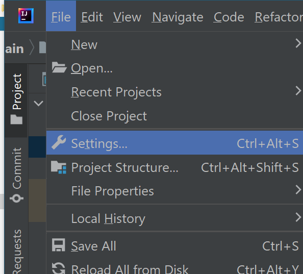

<h4 id="manual">Plugin Manual Installation</h4>
<ul>
<li>Goto <b>File-&gt;Settings-&gt;Plugins</b> or <b>(CTRL+ALT+S)</b> to enter plugin marketplace.</li>
<li>Click on settings icon and select <mark>Install Plugin From Disk</mark></li>
<li>Now browse the plugin in your pc</li>
<li>Now you will see plugin installed restart if required or apply and save</li>
<li>If you dont have plugin download zip file or .jar file from <a href="httls://offensive360.com">O360 Plugin</a></li>
</ul>

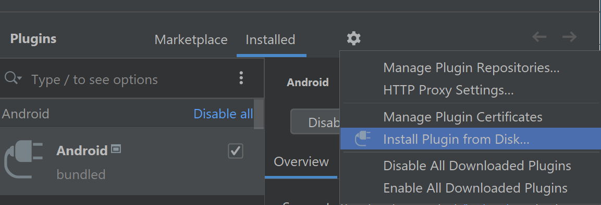

<small>[Optional]</small>  
Once Plugin was installed go to <b>File-&gt;Settings-&gt;Build-&gt;Build Tools-&gt;Gradle</b>. 
Click on Gradle and Enter Java 11.0.17 JDK. 

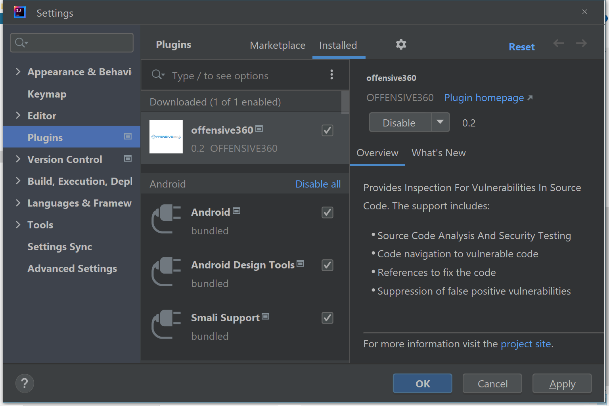

<h4>Server Configuration</h4>
In offensive360 tool bar click on settings Icon which will ask you server details. 
<ul>
<li> <b>SERVER_URL </b> : Host Address of the offensive360 api which will be provided by admin.</li>
<li><b>AUTH_TOKEN</b> :  Authentication Token provided by admin.</li>
<li>Invalid details will not allow a scan to run</li>
</ul>

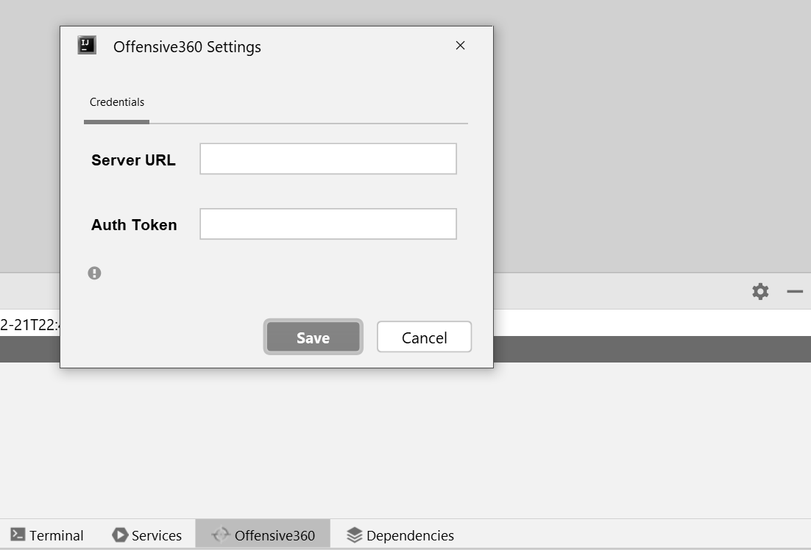

<h4>Running A Scan </h4>
Now click on Scan Icon which run scan on project source code and shows results. 
Right Click on File Popup Menu to run scan from there. 

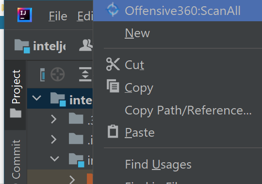
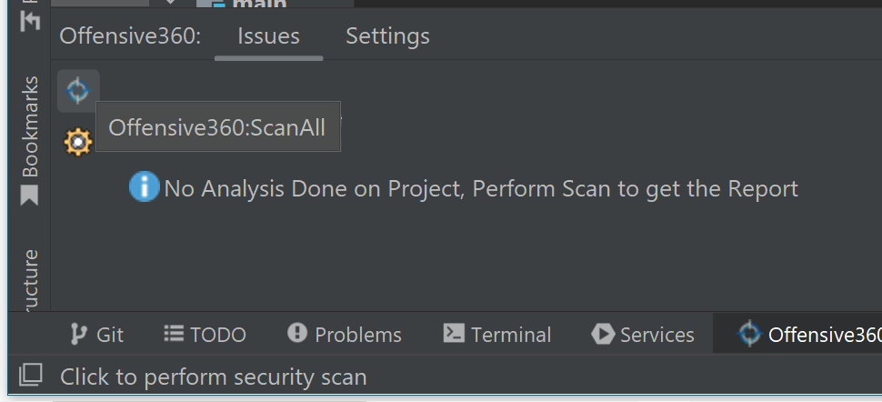
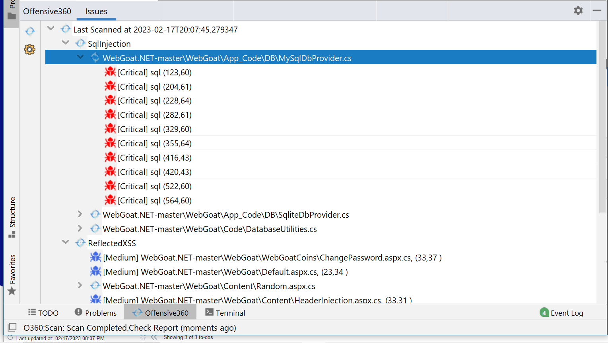

<h4>Features</h4>
Right click on any vulnerability to get menu where you can 

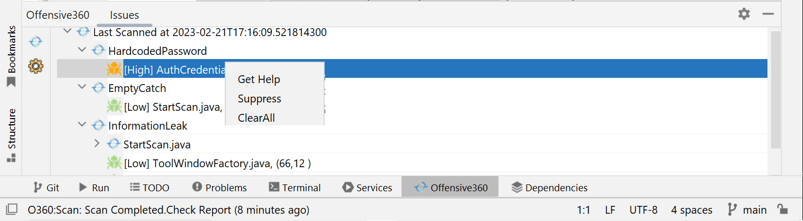
 

1.<b>Go To Code</b> Double click on vulenrability to navigate to vulnerability 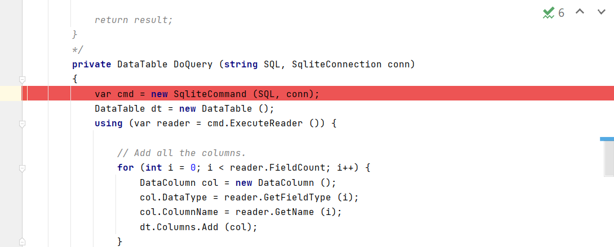 
2.<b>Suppress</b> False positive Vulnerabilities 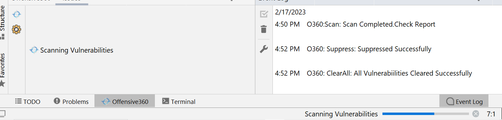  
3.<b>Get Help</b> with references for the vulnerability 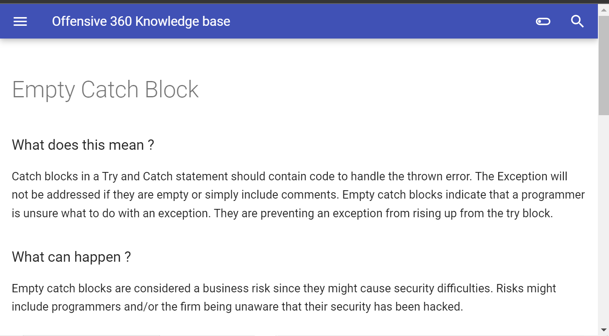   
4.<b>Clear All</b> vulnerabilities upon confirmation.  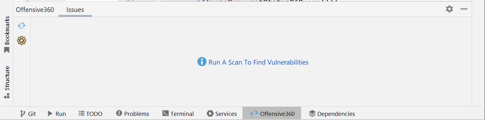

Let's find the vulnerabilities in one scan

